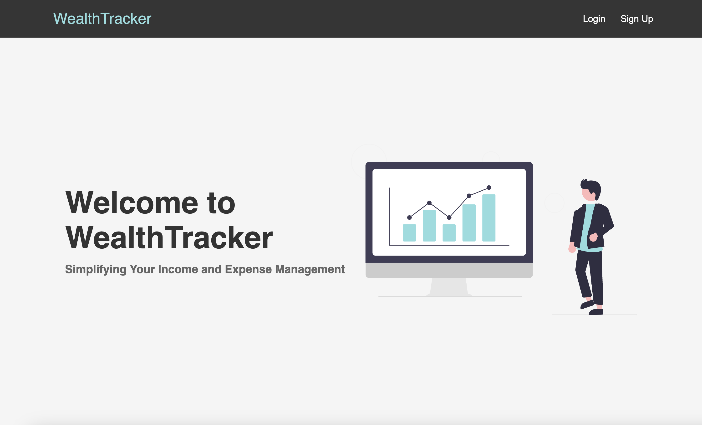
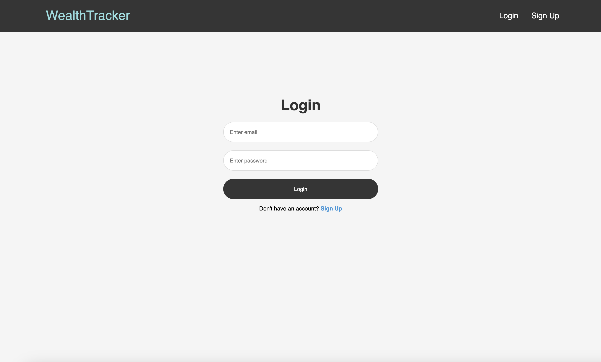
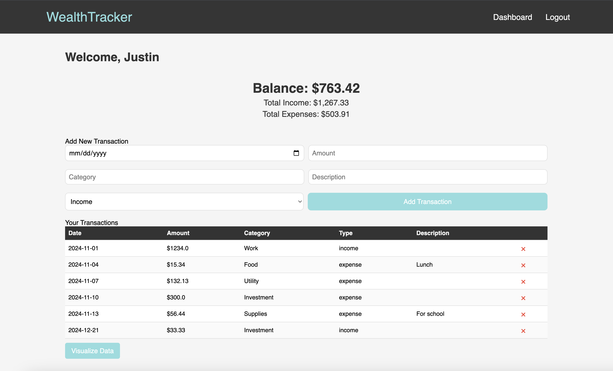
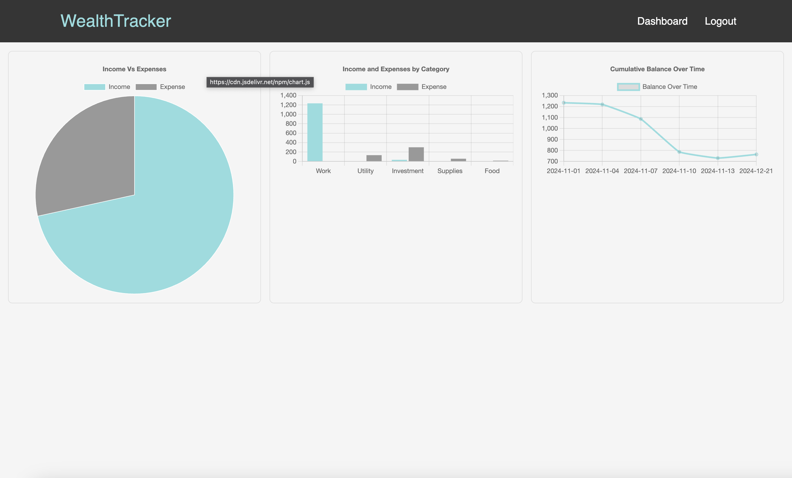

# Wealth-Tracker

Wealth-Tracker is a web application designed to help users track their income and expenses, visualize financial trends, and maintain a detailed financial dashboard. Built with Flask, SQLite, and Chart.js, this app provides an intuitive interface for managing your personal finances.

## About

Wealth-Tracker allows you to log your income and expenses under different categories, view detailed financial summaries, and visualize your financial data with pie charts and bar graphs. This app aims to simplify financial tracking for individuals by providing a clean, user-friendly interface and robust features, including:

- **User Authentication**: Secure sign-up, login, and logout functionality.
- **Income and Expense Logging**: Easily add and categorize your income and expenses.
- **Financial Visualizations**: Gain insights into your finances through interactive charts and graphs.
- **Monthly Summaries**: View monthly summaries of your financial data.
- **Responsive Design**: Works seamlessly on both mobile and desktop devices.

## Features

- User authentication (signup, login, logout)
- Income and expense logging
- Budget visualization with charts
- Monthly financial summaries
- Responsive design for mobile and desktop

## Technologies Used

- **Backend**: Flask
- **Frontend**: HTML, CSS, JavaScript
- **Database**: SQLite (or PostgreSQL, depending on your choice)
- **Charting**: Chart.js
- **Authentication**: Flask-Login
- **Version Control**: Git, GitHub

## Usage

After setting up the app:

1. Log in or sign up: Create an account or log into your existing account.
2. Add your income and expenses: Enter your income and expenses under the respective categories.
3. View your financial summary and trends: See your financial summary on the dashboard, including income vs expense breakdown.
4. Click “Visualize Data”: Examine your financial charts and trends through interactive visualizations.

## Screenshots

Here are some screenshots of the app in action:

Home Page  

Login 

Dashboard 

Charts 

## Contact

If you have any questions or suggestions, feel free to reach out to me at justinhlee01@gmail.com
